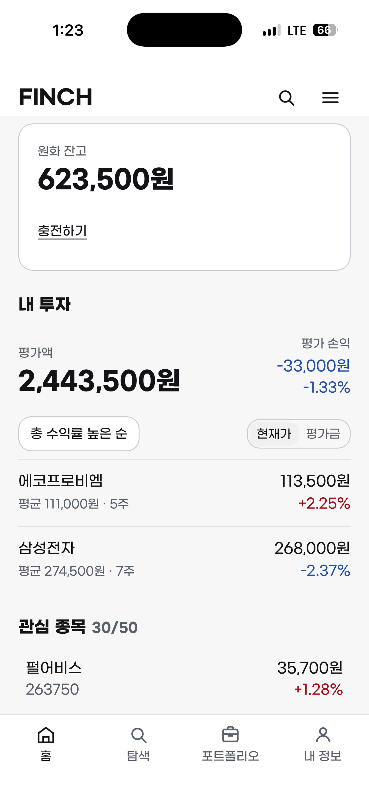
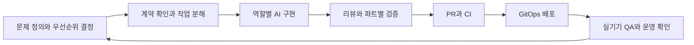
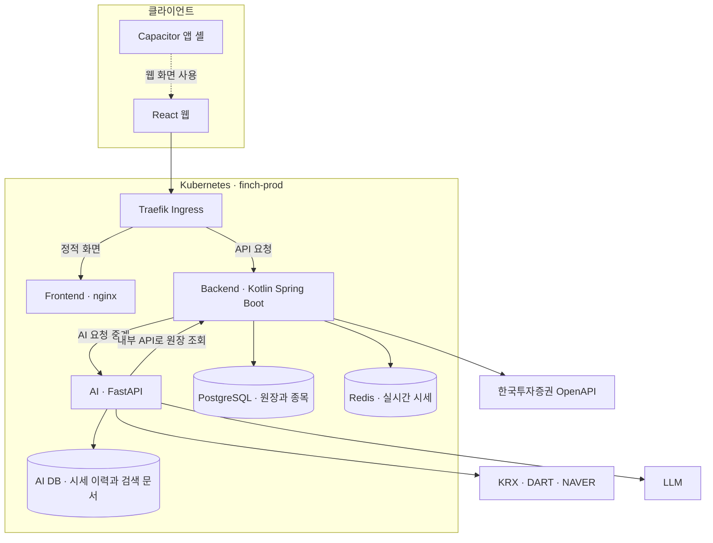

# FINCH

> 실제 시장 데이터로 모의투자를 경험하고,
> 내 포트폴리오를 근거로 AI와 함께 투자를 배우는 서비스.

[서비스 바로가기](https://app.finchapp.org) · [개발 기록](docs/adr/sprints) · [배포 인프라](https://github.com/tpals0409/finch-gitops)

  

모바일 홈에서 잔고와 투자 현황, 보유·관심 종목을 함께 확인할 수 있습니다.

## 1. 프로젝트 소개

FINCH는 실제 한국 주식 시세를 바탕으로 모의투자를 하고, 자신의 포트폴리오에 대해 AI에게 질문할 수 있는 서비스입니다. 가상 예수금으로 매수·매도를 경험하고, 보유 종목과 손익을 살펴보며 투자 판단을 돌아볼 수 있습니다.

**팀 프로젝트에서 출발해, 현재는 개인 버전인 ver2로 확장하고 있습니다.** AI Native Builder를 지향하며 AI 투자 비서뿐 아니라 역할별 개발 에이전트, 자동 검증, 배포와 운영 진단을 연결하는 개발 방식을 함께 다듬고 있습니다.

| 항목 | 내용 |
| --- | --- |
| 개발 형태 | 팀 프로젝트를 기반으로 한 개인 ver2 개발 |
| 제품 구성 | 모의 거래 · 포트폴리오 · 종목 탐색 · AI 질의응답과 브리핑 |
| 클라이언트 | React 웹과 Capacitor 기반 iOS·Android 앱 셸 |
| 핵심 설계 | 원장을 기준으로 한 자산 계산, 계산 엔진과 AI 설명의 역할 분리 |

<!-- 보완: 개발 기간과 팀 프로젝트 당시 담당 범위, ver2에서 직접 확장한 범위를 구분해 작성 -->

## 2. 주요 기능과 화면

### 모의 거래와 포트폴리오

가입 시 제공되는 가상 예수금 100만 원으로 실제 시세를 사용하는 모의 거래를 경험합니다. 예수금, 평가금액, 총자산과 종목별 손익은 충전·체결 기록을 기준으로 계산합니다.

<!-- 추가 화면 캡처: 매수·매도 화면 -->

### 종목 탐색과 시세 확인

종목 검색, 일봉 차트, 실시간 시세와 관심 종목을 제공합니다. 관심 있는 종목을 찾고, 가격 변화를 살펴본 뒤 모의 거래로 이어갈 수 있습니다.

<!-- 화면 캡처: 종목 검색과 상세 차트 -->

### 내 포트폴리오를 읽는 AI

AI 질의응답, 데일리 브리핑과 위험 진단을 통해 보유 자산을 살펴볼 수 있도록 구성했습니다. 원장과 시장 데이터에서 얻은 정보를 계산 엔진이 처리하고, AI는 그 결과와 공시·뉴스 근거를 바탕으로 설명합니다.

<!-- 화면 캡처: 실제 포트폴리오를 바탕으로 한 AI 응답과 근거 표시 -->

### 모바일에서 이어지는 경험

웹 화면을 Capacitor 앱 셸에 연결했습니다. iOS 실기기 QA를 통해 로그인, 화면 여백, 뒤로가기, 새로고침과 캐시 문제를 확인하며 모바일 사용 경험을 개선했습니다.

<!-- 화면 캡처 또는 GIF: 모바일 탐색 → 종목 확인 → 포트폴리오 흐름 -->

## 3. AI를 활용한 개발 과정

### 제품 판단과 구현 역할을 나눕니다

개발자가 제품의 범위와 우선순위를 정하고, AI 에이전트는 파트별 브리핑과 API 계약을 바탕으로 작업합니다. Backend·Frontend·AI·Design·Infra 등 역할마다 담당 파일과 책임을 구분합니다.

디자인 토큰은 디자이너 역할이 관리하고 프론트엔드는 이를 사용하는 식으로, 여러 에이전트가 같은 파일을 동시에 수정하는 상황도 줄였습니다. 개발 에이전트 Fin은 코드와 저장소를, 서버 에이전트 Pico는 클러스터 진단을 담당하며, 실제 배포는 Argo CD가 수행합니다.

### 판단에 필요한 맥락을 기록합니다

API 명세는 파트 간 계약으로, ADR은 결정과 시행착오의 기록으로 활용합니다. 세션이 바뀌어도 작업을 이어갈 수 있도록 역할별 브리핑에 제약과 검증 방법을 남깁니다.

파트별 검사 스크립트를 로컬과 CI에서 함께 사용하고, 완료 여부는 테스트·빌드 결과와 실제 산출물로 확인합니다. 실기기 동작과 서버 상태처럼 실행 환경에 따라 달라지는 결과는 해당 환경에서 확인한 근거를 별도로 기록합니다.

[개발 역할과 원칙](CLAUDE.md) · [CI 구성](.github/workflows/ci.yml) · [스프린트별 결정 기록](docs/adr/README.md)

## 4. 시스템 아키텍처

백엔드는 원장과 실시간 시세를 관리합니다. AI 서버는 내부 API로 원장을 읽고, 별도 DB에 적재한 시세 이력·공시·뉴스를 활용합니다. 프론트엔드는 백엔드만 호출하고, AI 서버는 외부에 직접 노출하지 않습니다.

### 주요 기술

| 영역 | 기술 |
| --- | --- |
| 프론트엔드 | React · TypeScript · Vite · TanStack Query · Zustand · Tailwind CSS · lightweight-charts |
| 백엔드 | Kotlin · Spring Boot · JPA · PostgreSQL · Redis · Flyway |
| AI | Python · FastAPI · SQLAlchemy · pgvector · pandas · pykrx |
| 모바일 | Capacitor · iOS · Android |
| 배포 | GitHub Actions · GHCR · Helm · Argo CD · Kubernetes |

## 5. 개발 철학과 설계 결정

### 계산은 엔진이, 설명은 AI가 맡습니다

수익률·집중도·기여도 같은 수치는 코드로 계산하고, LLM은 계산 결과를 설명하는 역할을 맡습니다. AI가 원장을 직접 변경하지 못하도록 경계를 두고, 사용자 자산에 대한 설명이 실제 데이터와 연결되도록 설계했습니다.

AI 평가에서도 수치 정확성, 근거 일치, 포트폴리오 정확성을 구분합니다. 설명의 자연스러움과 데이터의 정확성을 각각 확인하기 위한 접근입니다.

[AI 구성과 평가](ai/README.md) · [Backend–AI API 계약](docs/api/aiApiSpec.md)

### 자산의 기준은 원장 하나로 유지합니다

잔고와 손익의 기준을 충전·체결 기록으로 모았습니다. 화면이나 AI가 별도의 잔고를 유지하는 대신 백엔드의 원장을 읽도록 해, 데이터 출처가 갈라지는 상황을 줄였습니다.

이 원칙은 계산 로직과 조회 계약을 엄격하게 관리해야 한다는 비용을 수반합니다. 대신 값이 달라졌을 때 어떤 거래와 계산에서 차이가 생겼는지 추적할 수 있습니다.

[데이터 모델](docs/erd/erd.md) · [백엔드 API 명세](docs/api/apiSpec.md)

### 외부 API의 제약을 수집 범위에 반영합니다

호출 간격이 제한된 시세 API에서 모든 종목을 같은 빈도로 조회하기는 어렵습니다. 보유·관심·최근 조회 종목을 중심으로 수집하는 구조를 두고, 거래 가능 종목과 일별 시세 적재 대상의 일관성도 관리합니다.

실시간 갱신과 일별 이력 적재는 목적이 다릅니다. 각각의 수집 대상과 갱신 주기를 구분하고, 제한된 호출량 안에서 필요한 데이터를 확보하는 방향으로 개선합니다.

[시세 수집의 제약과 개선 설계](docs/design/kis-websocket.md) · [거래·적재 대상 정리 기록](docs/adr/sprints/sprint-13.md)

## 6. 운영과 유지보수

### 코드 변경부터 배포까지 추적합니다

PR을 거쳐 `master`에 반영된 변경은 GitHub Actions에서 이미지를 빌드하고, [finch-gitops](https://github.com/tpals0409/finch-gitops)에 배포할 이미지 태그를 반영합니다. Argo CD는 이 설정을 클러스터와 동기화합니다.

### 실제 사용에서 발견한 문제를 고칩니다

최근 개발에서는 iOS 실기기 QA를 통해 화면 여백, 뒤로가기, 무한스크롤과 새 버전이 반영되지 않는 캐시 문제를 개선했습니다. 배포 성공 여부와 사용자가 최신 화면을 보고 있는지를 별도로 확인할 필요가 있었습니다.

AI가 포트폴리오를 읽지 못한 문제도 원장 데이터 출처, 시각 오프셋, 캐시 스키마를 나누어 확인하며 수정했습니다. 거래 가능 종목과 시세 적재 대상을 하나의 목록으로 연결해, 매수한 종목의 시세 이력이 빠지는 문제에도 대응했습니다.

[실기기 QA와 포트폴리오 조회 개선 — Sprint 13](docs/adr/sprints/sprint-13.md)

## 7. 회고와 개선 방향

AI와 역할을 나누어 개발할수록 API 계약, 파일 소유권, 검증 기준을 명확히 정할 필요가 있었습니다. 구현 속도와 함께 결과를 확인하는 과정도 설계해야 했고, 실기기 QA와 서버 실측은 코드만 읽어서는 찾기 어려운 문제를 드러냈습니다.

다음 개선에서는 시세 갱신의 안정성, 모바일 사용 경험, AI 응답의 근거와 개인화 품질을 함께 살펴봅니다. 뉴스 브리핑의 종목별 가공 결과를 재사용하고 마지막 단계에서 개인화하는 방식 등 후속 과제는 개발 기록에 구분해 남겼습니다.

이 README는 구현과 설계 기록을 바탕으로 작성했습니다. Sprint 13 종료 시 앱에서의 AI 채팅·브리핑 확인과 일부 배치의 첫 자동 실행은 후속 검증 항목으로 남아 있습니다.

<!-- 보완: 후속 실사용 검증 결과, 개발 기간, 실제 화면 캡처와 확인 가능한 운영 성과 -->

## 관련 문서

- [기능 명세](docs/spec/featureSpec.md)
- [디자인 시스템](docs/design/finch-seed.md)
- [의사결정과 회고](docs/adr/README.md)
- [운영 기록과 절차](docs/ops/deploy-runbook.md)
