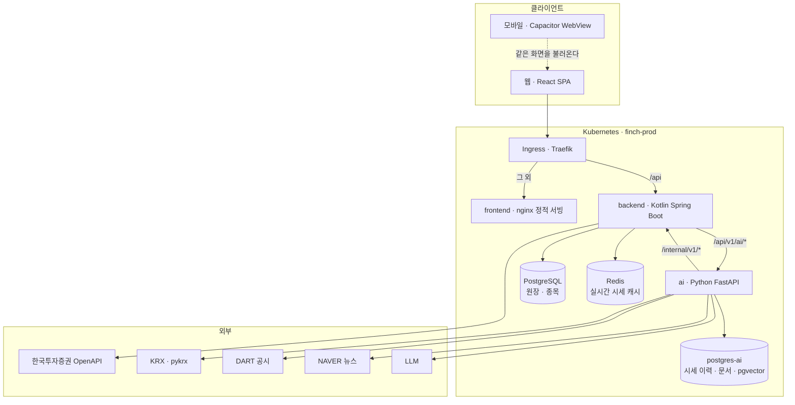

# FINCH

**돈을 잃지 않고 투자를 배우는 곳.** 실제 한국 주식 시세로 모의투자를 하고, 자기 포트폴리오를 근거로 설명해 주는 AI 에게 물어볼 수 있는 서비스입니다.

가입하면 가상 예수금 100만 원이 주어집니다. 시세는 진짜입니다 — 체결가·등락률·일봉 모두 실제 시장 데이터를 씁니다. 잃는 돈만 가짜입니다.

## 무엇을 하는가

| | |
|---|---|
| **모의 거래** | 정규장(09:00–15:30 KST) 시장가 매수·매도. 수수료·세금 없음 |
| **포트폴리오** | 예수금·평가금액·총자산·종목별 평가손익. **모든 값은 원장에서 계산**합니다 |
| **종목** | 검색, 일봉 차트(1M/3M/1Y), 실시간 시세, 관심 종목 |
| **AI** | 내 포트폴리오를 읽고 답하는 질의응답, 데일리 브리핑, 위험 진단 |
| **모바일** | iOS·Android 앱. 웹 화면을 그대로 담은 WebView 셸 |

원장이 원천입니다. 잔고와 손익은 저장된 값이 아니라 충전·체결 기록에서 매번 계산합니다 — 화면과 서버가 어긋날 자리를 만들지 않기 위해서입니다.

## 시스템 구조



### 경계가 왜 이렇게 나뉘어 있는가

**원장은 backend 것, 시장 데이터는 ai 것입니다.** ai 는 누가 무엇을 얼마나 들고 있는지를 `/internal/v1/*` 로 backend 에 물어보고, 과거 종가·섹터·공시·뉴스는 자기 DB 에서 읽습니다. 파생 지표(수익률·집중도·기여도)는 전부 ai 가 계산합니다.

**ai 는 외부에 노출되지 않습니다.** ingress 가 없고 backend 만 클러스터 안에서 부릅니다. backend ↔ ai 는 공유 토큰(`X-Internal-Token`)으로 인증합니다.

**실시간 시세는 핫셋만 받습니다.** 보유 ∪ 관심 ∪ 최근 본 종목의 합집합입니다. KIS 호출 간격 제한 때문에 전 종목을 돌 수 없고, 아무도 보지 않는 종목의 시세는 화면에 뜰 일이 없습니다.

## 기술 스택

| 파트 | 스택 |
|---|---|
| **frontend** | React · TypeScript · Vite · TanStack Query · zod · Zustand · Tailwind CSS · Radix UI · lightweight-charts |
| **backend** | Kotlin 2.3 · Spring Boot 4.1 · JPA · PostgreSQL · Redis · Flyway |
| **ai** | Python · FastAPI · SQLAlchemy(async) · asyncpg · Alembic · pgvector · pandas · pykrx |
| **mobile** | Capacitor 7 (iOS · Android) |
| **인프라** | Kubernetes · Argo CD · Helm · Traefik · GitHub Actions · GHCR |

## 데이터 원천

| 데이터 | 원천 | 경로 |
|---|---|---|
| 실시간 시세 | 한국투자증권 OpenAPI | backend → Redis |
| 일별 종가·거래량 | KRX · pykrx | ai 배치 → `price_daily` |
| 종목 마스터·섹터 | KRX | ai 배치 |
| 공시 | DART | ai 배치 → 문서 검색 |
| 뉴스 | NAVER 검색 | ai 배치 → 문서 검색 |

## 배포

`master` 에 머지되면 GitHub Actions 가 이미지를 만들고 태그를 [finch-gitops](https://github.com/tpals0409/finch-gitops) 에 올립니다. Argo CD 가 그 변경을 보고 클러스터에 반영합니다. **클러스터를 직접 고치지 않습니다** — 되돌아갑니다.

```
master 머지 → CI → 이미지 빌드(GHCR) → gitops 태그 갱신 → Argo CD 동기화
```

## 저장소 구조

```
frontend/   웹 화면 (SPA)
backend/    주문·계좌·원장·시세 수집 API
ai/         AI API · 시장 데이터 적재 배치
mobile/     Capacitor 앱 셸
infra/      로컬 compose · nginx 설정
docs/       명세 · 규약 · ADR
```

## 문서

- `docs/spec/` — 기능 명세
- `docs/api/` — API 명세
- `docs/erd/` — 데이터 모델
- `docs/adr/sprints/` — 스프린트별 결정 기록
- `docs/convention/` · 각 파트의 `CLAUDE.md` — 코드 규약

## 개발

각 파트의 `CLAUDE.md` 와 `docs/convention/` 을 먼저 읽으십시오. 로컬 실행은 `infra/` 의 compose 설정을 씁니다.
