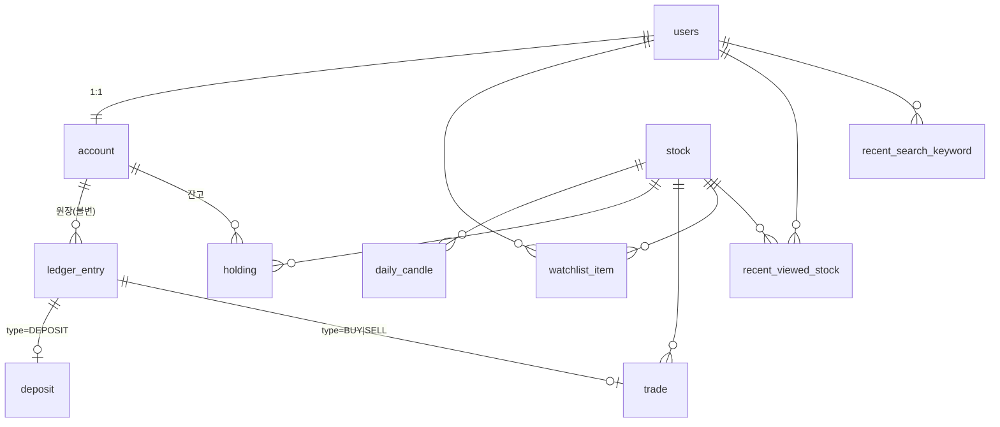

# 백엔드 DB 스키마(ERD) 설계

- 문서 버전: v1.1
- 작성일: 2026-08-24 / 최종 수정: 2026-09-03
- 기준 문서: [기능 명세서 v2.2](../spec/featureSpec.md) · [백엔드 API 명세 v0.7](../api/apiSpec.md) · [백엔드 컨벤션](../convention/backConvention.md)
- 변경 이력:
  - v1.0 — MVP 스키마 11개 테이블 확정. Flyway `V1__init.sql` 의 입력
  - v1.1 — **투자 회차·계좌 리셋 제거**(이슈 #27). `investment_round` → `account` 교체,
    자식 4개 테이블의 `round_id` → `account_id`, 원장 유형 6종 → 4종. Flyway `V2__replace_round_with_account.sql`
- 범위: 백엔드 DB의 MVP 스키마 전체. Flyway 마이그레이션 작성의 입력 문서다.
- 범위 밖: AI 파트 DB(`ai_invest`), Redis 저장 데이터, 확장 기능 스키마.

---

## 0. 요약

11개 테이블이다. 원장(`ledger_entry`)이 잔고 변동의 단일 진실 공급원이고, 예수금과 보유 종목은
같은 트랜잭션에서 갱신되는 파생 스냅샷이다. 종목 마스터와 일봉은 백엔드가 소유한다.



---

## 1. 설계 결정과 기각한 대안

### 1.1 종목 마스터·일봉을 백엔드 DB가 소유한다

`stock`(전종목 마스터)과 `daily_candle`(일봉)을 백엔드 DB에 둔다. 수집 워커가 KIS에서 채우고,
검색(apiSpec 5.1)과 차트(5.3)는 DB에서 서빙한다. 현재가만 Redis 캐시다.

- **KIS 프록시 기각** — 팀이 앱키를 공유하므로 호출 한도도 공유된다(featureSpec 1.2). 검색 자동완성이
  한도를 먹으면 시세 수신이 같이 죽는다. 거래정지 플래그·종목명을 우리가 통제할 수 있는 이점도 크다.
- **AI DB의 `instruments` 공유 참조 기각** — DB를 둘로 나눈 결정(backConvention 1장, Flyway/Alembic
  이력 분리)과 파트 간 소유권 경계를 깬다.
- 대가: 마스터 동기화 배치와 일봉 적재 배치가 필요하다.

### 1.2 원장 1개 + 도메인 테이블 분리

`ledger_entry`가 4종 유형을 전부 담는 불변 시계열이고, `deposit`·`trade`가 유형별 상세를 1:1로 든다.

- **단일 wide 테이블 기각** — 유형별로 유효한 컬럼이 달라 DB 제약으로 무결성을 거의 못 건다.
- **도메인 테이블만 두고 UNION 기각** — 커서 페이징(apiSpec 1.5)과 예수금 재계산이 여러 테이블을
  가로질러야 해서 "원장이 단일 진실 공급원"(featureSpec 11장)이 흐려진다.
- apiSpec이 `depositId`(4.2)·`orderId`(7.1)·`transactionId`(8.2)를 다른 이름으로 내려주는 것과
  이 구조가 그대로 맞는다. `transactionId` = `ledger_entry.id`.

### 1.3 예수금·보유 종목은 물질화한다

`account.cash_balance`와 `holding` 테이블을 유지한다. 원장이 진실이고 둘은 파생이며,
같은 트랜잭션에서만 갱신된다.

- **전량 원장 집계 기각** — 평균 매수가가 단순 합계로 나오지 않아 매도마다 전체 재생이 필요하고,
  락을 걸 행이 없어 동시 주문 직렬화가 까다롭다(featureSpec 11장).
- 불일치는 §4의 불변식을 검증하는 통합 테스트로 막는다.

### 1.4 휘발성 데이터는 ERD에 넣지 않는다

Refresh Token, 멱등성 키, 현재가 캐시는 Redis에 둔다(backConvention 1·5장 그대로).

- Refresh Token: `refresh:{userId}` TTL 14일. 회전은 덮어쓰기, 로그아웃(apiSpec 2.3)은 삭제.
- 멱등성 키: TTL 24시간. 값에 요청 본문 해시와 최초 응답을 함께 저장한다(apiSpec 1.4).
- 대가: Redis 재기동 시 전원 재로그인이고 멱등성 보장이 날아간다. 가상 자산이라 감수한다.
- **DB 테이블 기각** — 만료 행 청소 배치가 둘 늘고 로그인마다 DB 쓰기가 생긴다.

### 1.5 계좌는 users와 1:1인 `account` 한 행이다

계좌 리셋과 투자 회차를 제거했다(이슈 #27). 실제 투자 서비스에는 계좌를 초기화하고 다시 시작하는
기능이 없고, 회차는 리셋 시점을 경계로 원장을 나누던 부산물이라 리셋과 함께 사라진다.

v1.0에서는 `investment_round`가 계좌 역할을 겸했다. 그 테이블이 곧 계좌였으므로 회차 제거는
**테이블 삭제가 아니라 `account`로의 교체**다. 예수금·누적 충전액이 그대로 넘어오고,
`ledger_entry`·`deposit`·`trade`·`holding`의 `round_id`는 `account_id`가 된다.

- 사용자당 계좌 1개다. `ux_round_active`(활성 회차 1개)가 하던 일을 `user_id` UNIQUE가 대신한다.
- 원장은 여전히 삭제하지 않는다. 다만 회차 경계가 없으므로 전체가 하나의 연속된 시계열이다.
- **users와 1:1인데 왜 users에 합치지 않는가** — 계좌 컬럼(예수금·누적 충전액)은 주문·충전 트랜잭션이
  `FOR UPDATE`로 잠그는 대상이고, 로그인·프로필 갱신이 건드리는 `users`와 락 경합을 만들 이유가 없다.
  결제 서버 분리 시 넘어갈 경계도 이 테이블이다.

---

## 2. 테이블 정의

공통 규약: 모든 시각 컬럼은 `TIMESTAMPTZ`, 금액·수량은 `BIGINT`(원 단위 정수), 종목코드는 `CHAR(6)`,
PK는 `BIGINT GENERATED ALWAYS AS IDENTITY`, 이름은 snake_case다(backConvention 3·6장).

### 2.1 users — 회원

| 컬럼 | 타입 | 제약 | 설명 |
|---|---|---|---|
| `id` | BIGINT | PK | |
| `kakao_id` | BIGINT | NOT NULL, UNIQUE | 카카오 회원번호. 로그인 시 조회 키 |
| `nickname` | VARCHAR(50) | NOT NULL | |
| `profile_image_url` | VARCHAR(500) | NULL | |
| `created_at` | TIMESTAMPTZ | NOT NULL | `GET /users/me`의 `joinedAt` |
| `updated_at` | TIMESTAMPTZ | NOT NULL | |

탈퇴는 MVP 범위 밖이므로 소프트 삭제 컬럼을 두지 않는다(featureSpec 2.1).

### 2.2 account — 계좌

| 컬럼 | 타입 | 제약 | 설명 |
|---|---|---|---|
| `id` | BIGINT | PK | |
| `user_id` | BIGINT | NOT NULL, **UNIQUE**, FK → users | 1:1 |
| `cash_balance` | BIGINT | NOT NULL, **CHECK >= 0** | 예수금 스냅샷 |
| `total_deposited_amount` | BIGINT | NOT NULL DEFAULT 0, CHECK 0 ~ 100000000 | 계정 전체 누적 충전액 |
| `created_at` / `updated_at` | TIMESTAMPTZ | NOT NULL | |

제약:

```sql
UNIQUE (user_id)
CHECK (cash_balance >= 0)
CHECK (total_deposited_amount BETWEEN 0 AND 100000000)
```

`user_id` UNIQUE가 "사용자당 계좌 1개"를 DB에서 보장한다. 리셋이 없으므로 한 사용자가 계좌를
둘 가질 경로 자체가 없다.

`total_deposited_amount`는 **계좌 평생 누적**이다. 회차가 없어지면서 충전 한도의 기준 기간도
회차가 아니라 계정 전체가 되었다(featureSpec 1.1). 컬럼 위치가 곧 그 결정의 표현이다 —
기간(월 등) 기준으로 뒤집으면 이 컬럼을 버리고 `deposit`을 기간으로 집계해야 한다.

`id`는 API 응답에 나가지 않는다. 계좌는 사용자당 하나라 클라이언트가 지목할 대상이 아니고,
모든 요청은 토큰의 사용자로 계좌를 찾는다(apiSpec 1.6).

### 2.3 ledger_entry — 원장 (불변)

| 컬럼 | 타입 | 제약 | 설명 |
|---|---|---|---|
| `id` | BIGINT | PK | `transactionId` |
| `account_id` | BIGINT | NOT NULL, FK → account | |
| `type` | VARCHAR(16) | NOT NULL, CHECK IN (4종) | |
| `cash_delta` | BIGINT | NOT NULL | 예수금 증감 |
| `cash_balance_after` | BIGINT | NOT NULL, CHECK >= 0 | 기록 직후 예수금 |
| `occurred_at` | TIMESTAMPTZ | NOT NULL | 응답의 `occurredAt` |
| `created_at` | TIMESTAMPTZ | NOT NULL | |

유형별 `cash_delta` 부호:

| `type` | `cash_delta` | 상세 테이블 |
|---|---|---|
| `INITIAL_GRANT` | +1,000,000 | 없음 |
| `DEPOSIT` | + 충전액 | `deposit` |
| `BUY` | − 체결금액 | `trade` |
| `SELL` | + 체결금액 | `trade` |

`ROUND_OPEN`·`ROUND_CLOSE`는 회차 전환을 기록하던 `cash_delta = 0` 행이라 회차와 함께 사라졌다.
기록할 사건 자체가 없다.

인덱스:

```sql
CREATE INDEX ix_ledger_account_id_desc ON ledger_entry (account_id, id DESC);
CREATE INDEX ix_ledger_account_type_id ON ledger_entry (account_id, type, id DESC);
```

`GET /transactions`는 이 테이블 하나만 커서 페이징한다. 커서는 `id` 기준이고 정렬은 최신순 고정이다.

**이 테이블은 불변이다.** UPDATE·DELETE를 하지 않고 정정은 반대 분개로 한다(backConvention 6장).
애플리케이션 규약으로 지키고, 애플리케이션 DB 계정에서 이 테이블의 UPDATE·DELETE 권한을 회수해
DB 차원에서도 막는다.

### 2.4 deposit — 충전 상세

| 컬럼 | 타입 | 제약 | 설명 |
|---|---|---|---|
| `id` | BIGINT | PK | `depositId` |
| `ledger_entry_id` | BIGINT | NOT NULL, **UNIQUE**, FK → ledger_entry | 1:1 |
| `account_id` | BIGINT | NOT NULL, FK → account | 한도 재계산·감사용 |
| `amount` | BIGINT | NOT NULL, CHECK 0 < amount <= 10000000 | 1회 한도를 DB가 보장 |
| `payment_method` | VARCHAR(20) | NOT NULL, CHECK IN ('VIRTUAL_CARD','VIRTUAL_TRANSFER') | |
| `created_at` | TIMESTAMPTZ | NOT NULL | |

```sql
CREATE INDEX ix_deposit_account ON deposit (account_id);
```

충전 취소가 없으므로(featureSpec 1.1) 취소 상태 컬럼을 두지 않는다.

### 2.5 trade — 체결 상세

MVP는 시장가 즉시 체결이라 접수와 체결이 분리되지 않는다. 주문 1건 = 이 테이블 1행이고,
`id`가 `orderId`(apiSpec 7.1)이자 `tradeId`(9.2)다. **별도 `order` 테이블을 두지 않는다.**

| 컬럼 | 타입 | 제약 | 설명 |
|---|---|---|---|
| `id` | BIGINT | PK | `orderId` = `tradeId` |
| `ledger_entry_id` | BIGINT | NOT NULL, **UNIQUE**, FK → ledger_entry | 1:1 |
| `account_id` | BIGINT | NOT NULL, FK → account | |
| `stock_code` | CHAR(6) | NOT NULL, FK → stock | |
| `side` | VARCHAR(4) | NOT NULL, CHECK IN ('BUY','SELL') | |
| `quantity` | BIGINT | NOT NULL, CHECK > 0 | |
| `executed_price` | BIGINT | NOT NULL, CHECK > 0 | 체결 시점 최신 수신 가격 |
| `executed_amount` | BIGINT | NOT NULL, CHECK = quantity * executed_price | |
| `avg_buy_price` | BIGINT | NULL | **매도 시 체결 직전 평균 매수가 스냅샷** |
| `realized_profit` | BIGINT | NULL | 매도 시 실현손익 |
| `executed_at` | TIMESTAMPTZ | NOT NULL | |

```sql
CHECK ( (side = 'SELL' AND avg_buy_price IS NOT NULL AND realized_profit IS NOT NULL)
     OR (side = 'BUY'  AND avg_buy_price IS NULL     AND realized_profit IS NULL) )
CREATE INDEX ix_trade_account_id_desc ON trade (account_id, id DESC);
CREATE INDEX ix_trade_account_stock   ON trade (account_id, stock_code, id DESC);
```

`realizedProfitRate`(apiSpec 8.2)는 저장하지 않고 `realized_profit / (avg_buy_price * quantity) * 100`으로
계산한다. 평단은 매도 후 바뀌므로 스냅샷 컬럼이 없으면 과거 수익률을 재현할 수 없다 — 그래서
`avg_buy_price`만 저장하고 비율은 파생으로 둔다.

### 2.6 holding — 보유 종목

| 컬럼 | 타입 | 제약 | 설명 |
|---|---|---|---|
| `id` | BIGINT | PK | |
| `account_id` | BIGINT | NOT NULL, FK → account | |
| `stock_code` | CHAR(6) | NOT NULL, FK → stock | |
| `quantity` | BIGINT | NOT NULL, CHECK >= 0 | |
| `avg_buy_price` | BIGINT | NOT NULL, CHECK >= 0 | 가중평균 매입 단가 |
| `updated_at` | TIMESTAMPTZ | NOT NULL | |

```sql
UNIQUE (account_id, stock_code)
CHECK (quantity > 0 OR avg_buy_price = 0)
CREATE INDEX ix_holding_account_held ON holding (account_id) WHERE quantity > 0;
```

**전량 매도 시 행을 지우지 않고 `quantity = 0`, `avg_buy_price = 0`으로 남긴다.** 조회는
`quantity > 0`으로 거르고, 재매수 시 INSERT 경합 없이 같은 행을 갱신한다. featureSpec 7.3의
"잔고에서 제거"는 화면 기준으로 해석했다.

계좌당 종목 1행이고 그 행이 현재 잔고 그 자체다. 회차별 읽기 전용 스냅샷이라는 성격은 사라졌고,
과거의 보유 이력은 `trade`로만 남는다.

### 2.7 stock — 종목 마스터

| 컬럼 | 타입 | 제약 | 설명 |
|---|---|---|---|
| `stock_code` | CHAR(6) | **PK** | 선행 0 보존. 정수 금지 |
| `stock_name` | VARCHAR(100) | NOT NULL | |
| `market` | VARCHAR(10) | NOT NULL, CHECK IN ('KOSPI','KOSDAQ') | |
| `suspended` | BOOLEAN | NOT NULL DEFAULT false | 거래정지 |
| `suspended_reason` | VARCHAR(200) | NULL | |
| `previous_close` | BIGINT | NULL | 전일 종가. 등락 계산 기준 |
| `is_active` | BOOLEAN | NOT NULL DEFAULT true | 상장폐지 시 false |
| `updated_at` | TIMESTAMPTZ | NOT NULL | |

```sql
CREATE EXTENSION IF NOT EXISTS pg_trgm;
CREATE INDEX ix_stock_name_trgm ON stock USING GIN (stock_name gin_trgm_ops);
```

검색은 2글자 이상 부분 일치 자동완성이므로(featureSpec 4장) B-tree로는 접두사만 커버된다.
`previous_close`는 `daily_candle`에서 유도할 수 있지만 등락 계산에 매 요청 쓰이므로 일 1회 배치로
여기에 캐시한다. **의도적 중복이다.**

### 2.8 daily_candle — 일봉

| 컬럼 | 타입 | 제약 |
|---|---|---|
| `stock_code` | CHAR(6) | PK(복합), FK → stock |
| `trade_date` | DATE | PK(복합) |
| `open_price` / `high_price` / `low_price` / `close_price` | BIGINT | NOT NULL, CHECK > 0 |
| `volume` | BIGINT | NOT NULL, CHECK >= 0 |

```sql
PRIMARY KEY (stock_code, trade_date)
CHECK (high_price >= low_price AND high_price >= open_price AND high_price >= close_price
       AND low_price <= open_price AND low_price <= close_price)
```

PK가 곧 `period=1M|3M|1Y` range scan의 인덱스다. 분봉 도입 시(S0-4) 이 테이블을 건드리지 않고
`minute_candle`을 새로 만든다.

### 2.9 watchlist_item — 관심 종목

| 컬럼 | 타입 | 제약 |
|---|---|---|
| `id` | BIGINT | PK |
| `user_id` | BIGINT | NOT NULL, FK → users |
| `stock_code` | CHAR(6) | NOT NULL, FK → stock |
| `created_at` | TIMESTAMPTZ | NOT NULL — 응답의 `registeredAt` |

```sql
UNIQUE (user_id, stock_code)   -- WATCHLIST_ALREADY_EXISTS 를 DB가 판정
CREATE INDEX ix_watchlist_user ON watchlist_item (user_id, created_at DESC);
```

최대 50개는 DB 제약으로 표현할 수 없어 애플리케이션이 검증한다(`WATCHLIST_LIMIT_EXCEEDED`).
`sort=REGISTERED`는 위 인덱스로, `sort=NAME`은 `stock`과 조인해 DB에서 정렬한다.
`sort=CHANGE_RATE`는 기준 값이 Redis 시세 캐시에 있으므로 애플리케이션에서 정렬한다.

### 2.10 recent_viewed_stock — 최근 본 종목

| 컬럼 | 타입 | 제약 |
|---|---|---|
| `id` | BIGINT | PK |
| `user_id` | BIGINT | NOT NULL, FK → users |
| `stock_code` | CHAR(6) | NOT NULL, FK → stock |
| `viewed_at` | TIMESTAMPTZ | NOT NULL |

```sql
UNIQUE (user_id, stock_code)
CREATE INDEX ix_recent_viewed_user ON recent_viewed_stock (user_id, viewed_at DESC);
```

`GET /stocks/{stockCode}` 처리 중 UPSERT한다(별도 등록 API 없음, apiSpec 5.2). 유니크 제약이
"중복 없이 최상단 갱신"을 보장하고, 30건 FIFO 상한은 UPSERT 후 초과분을 삭제해 유지한다.

### 2.11 recent_search_keyword — 최근 검색어

| 컬럼 | 타입 | 제약 |
|---|---|---|
| `id` | BIGINT | PK — `DELETE /stocks/search/recent/{keywordId}`의 그 값 |
| `user_id` | BIGINT | NOT NULL, FK → users |
| `keyword` | VARCHAR(50) | NOT NULL |
| `searched_at` | TIMESTAMPTZ | NOT NULL |

```sql
UNIQUE (user_id, keyword)
CREATE INDEX ix_recent_keyword_user ON recent_search_keyword (user_id, searched_at DESC);
```

최대 10건. 같은 검색어를 다시 검색하면 `searched_at`만 갱신한다.

---

## 3. 트랜잭션 시나리오

### 3.1 최초 로그인 (`POST /auth/kakao`, 신규)

한 트랜잭션에서: `users` INSERT → `account` INSERT(`cash_balance=1000000`,
`total_deposited_amount=0`) → `ledger_entry` INSERT(`INITIAL_GRANT`, delta +1,000,000,
`cash_balance_after=1000000`).

### 3.2 주문 체결 (`POST /orders`)

apiSpec 7.2의 5단계를 이 스키마에 매핑한다.

```
1~3. 거래시간 · 거래정지(stock.suspended) · 최신가(Redis) 확인
4.   SELECT ... FROM account WHERE id = ? FOR UPDATE               ← 직렬화 지점
     SELECT ... FROM holding WHERE account_id = ? AND stock_code = ?
     매수: cash_balance >= quantity * price 인지 재검증
     매도: holding.quantity >= quantity 인지 재검증
5.   INSERT ledger_entry (BUY|SELL, cash_delta, cash_balance_after)
     INSERT trade        (ledger_entry_id, ...)
     UPSERT holding      (매수: 가중평균 재계산 / 매도: 수량 차감)
     UPDATE account SET cash_balance = ?
```

락 대상이 계좌 한 행뿐이라 같은 사용자의 동시 주문이 직렬화된다.
`cash_balance >= 0` CHECK가 애플리케이션 검증을 통과한 버그를 DB 바닥에서 한 번 더 막는다.
4번에서 부족하면 수량을 줄이지 않고 거부한다(`ORDER_PRICE_CHANGED` / `ORDER_INSUFFICIENT_QUANTITY`).

### 3.3 충전 (`POST /deposits`)

`account` FOR UPDATE → `total_deposited_amount + amount <= 100,000,000` 검증 →
`ledger_entry`(`DEPOSIT`) INSERT → `deposit` INSERT → `account`의 `cash_balance`와
`total_deposited_amount` UPDATE.

한도는 계정 전체 누적이다. 리셋이 없으므로 한도를 되돌릴 경로도 없다.

---

## 4. 불변식

통합 테스트가 직접 검증한다. 원장과 스냅샷이 갈라지면 여기서 잡힌다.

| # | 불변식 |
|---|---|
| 1 | `account.cash_balance` = `SUM(ledger_entry.cash_delta WHERE account_id = ?)` |
| 2 | `account.total_deposited_amount` = `SUM(deposit.amount WHERE account_id = ?)` |
| 3 | `holding.quantity` = 계좌·종목별 `SUM(trade.quantity * CASE side WHEN 'BUY' THEN 1 ELSE -1 END)` |
| 4 | 사용자별 `account`는 정확히 1개 |
| 5 | `ledger_entry`의 행은 생성 후 변경되지 않는다 |
| 6 | `type='DEPOSIT'`인 `ledger_entry`는 `deposit` 1행과, `BUY`·`SELL`은 `trade` 1행과 정확히 짝을 이룬다 |

---

## 5. API ↔ 테이블 매핑

| 엔드포인트 | 읽는/쓰는 테이블 |
|---|---|
| `GET /users/me` | users |
| `GET /account` | account, holding + 시세 캐시 |
| `GET /deposits/limit` | account |
| `POST /deposits` | account, ledger_entry, deposit |
| `GET /stocks/search` | stock |
| `GET /stocks/{code}` | stock, holding, watchlist_item, recent_viewed_stock(쓰기) + 시세 캐시 |
| `GET /stocks/{code}/candles` | daily_candle |
| `GET /stocks/{code}/price`, `GET /stocks/prices` | 시세 캐시(Redis)만 |
| `GET/DELETE /stocks/recent` | recent_viewed_stock, stock |
| `GET/DELETE /stocks/search/recent` | recent_search_keyword |
| `GET/POST/DELETE /watchlist` | watchlist_item, stock, holding |
| `POST /orders` | account, ledger_entry, trade, holding, stock |
| `GET /orders/available` | account, holding, stock + 시세 캐시 |
| `GET /portfolio` | account, holding, stock + 시세 캐시 |
| `GET /transactions` | ledger_entry, deposit, trade, stock |
| `GET /internal/v1/portfolio` | account, holding, stock |
| `GET /internal/v1/trades` | trade |

`/api/v1/ai/**` 중계 경로는 DB를 읽지 않는다.

---

## 6. 이 ERD에 없는 것

| 대상 | 어디에 있나 |
|---|---|
| Refresh Token | Redis (§1.4) |
| 멱등성 키 | Redis, TTL 24시간 |
| 현재가·등락률·`stale` 판정 | Redis 시세 캐시. `asOf`가 신선도를 표현한다 |
| `instruments`, `price_daily`, `documents`, `embeddings`, `events`, `wiki`, `ai_responses` | AI 파트 DB(`ai_invest`) 소유. 백엔드는 알 필요가 없다 |
| 지정가 주문·미체결 | 확장 범위. 도입 시 `order` 테이블을 신설해 `trade`와 1:N으로 잇는다 |
| 충전 취소 | 확장 범위. 충전 건별 사용 추적 설계가 선행 |
| 총자산 추이·매매 메모·월별 요약 | 확장 범위 |
| 분봉 | S0-4 확정 후 `minute_candle` 신설 |

---

## 7. 확정 사항과 후속 과제

**이 문서에서 확정한 것**

- 관심 종목·최근 본 종목·최근 검색어는 **계좌가 아니라 계정(`user_id`)에 귀속된다.**
  featureSpec 5장이 최근 본 종목을 "계정 기준"으로 못박았고, 셋 다 거래 기록이 아니라 탐색 기록이라
  계좌에 묶을 이유가 없다. (v1.0에서는 "리셋해도 유지된다"가 이 결정의 근거였고, 리셋이 사라진
  지금은 계좌와 계정이 1:1이라 실질 차이가 없다.)
- 주문과 체결을 한 테이블(`trade`)로 합친다. 시장가 즉시 체결만 있는 MVP 전제에 의존한다.
  지정가가 들어오면 `order`를 신설하고 `trade`를 그 하위로 내린다.

**후속 과제**

| # | 항목 | 비고 |
|---|---|---|
| 1 | ~~Flyway `V1__init.sql` 작성~~ | 완료(2026-09-02). 회차 제거는 `V2__replace_round_with_account.sql` |
| 2 | 종목 마스터 동기화 배치 · 일봉 적재 배치 설계 | §1.1의 대가. KIS 호출 설계와 함께 |
| 3 | `stock.suspended` 갱신 주기 | S0-1 실측 결과에 의존 |
| 4 | 서버 DB 리네임 (`moutoss_db` → `finch_db`) | 이름은 **`finch_db`로 확정**했다(backConvention 1장·`application.yaml`). 서버에 만들어진 DB와 `postgres-secret`의 `POSTGRES_DB` 갱신이 남았다. 백엔드 DB에는 아직 테이블이 하나도 없어 `ALTER DATABASE ... RENAME`으로 끝나므로 **지금이 가장 싸다** |
